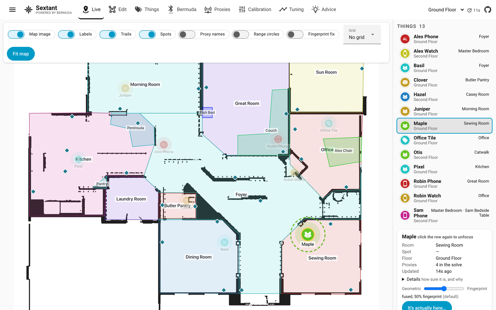
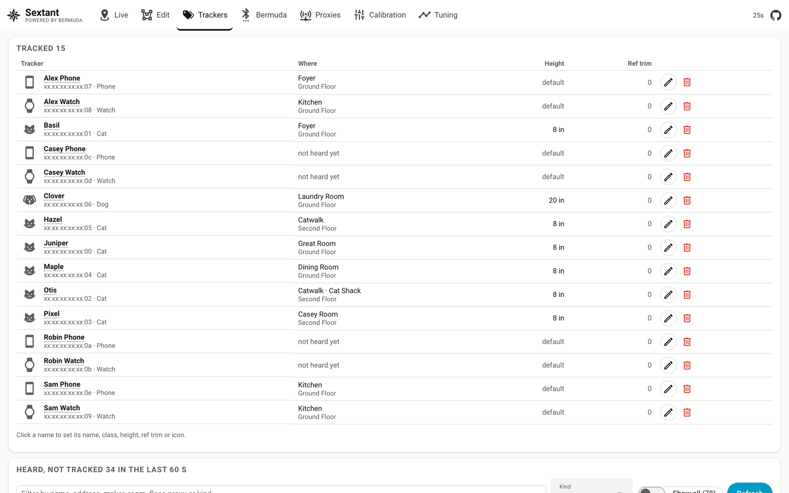
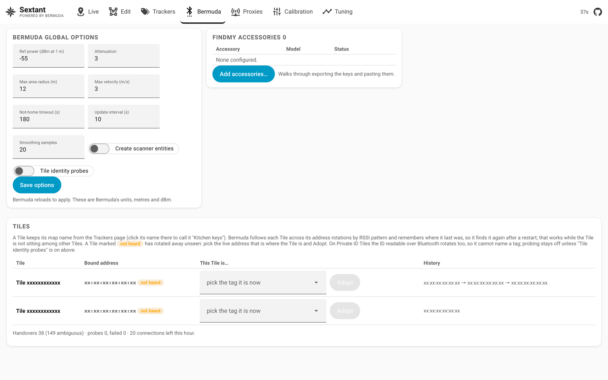
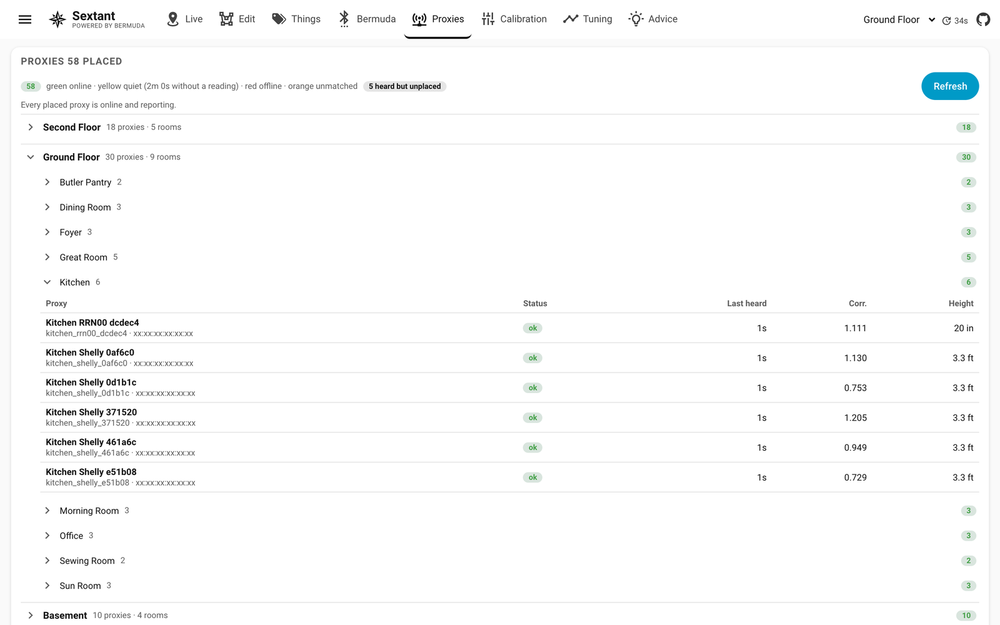
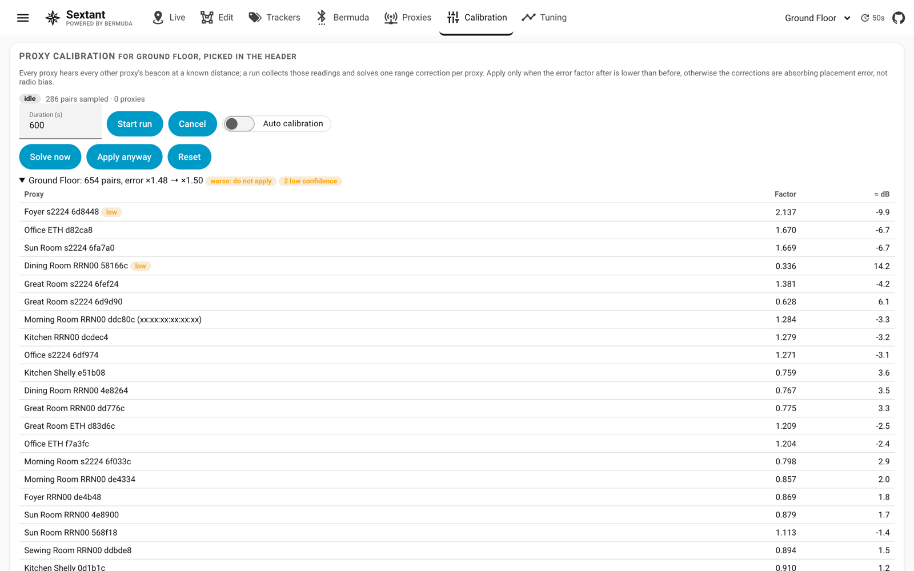
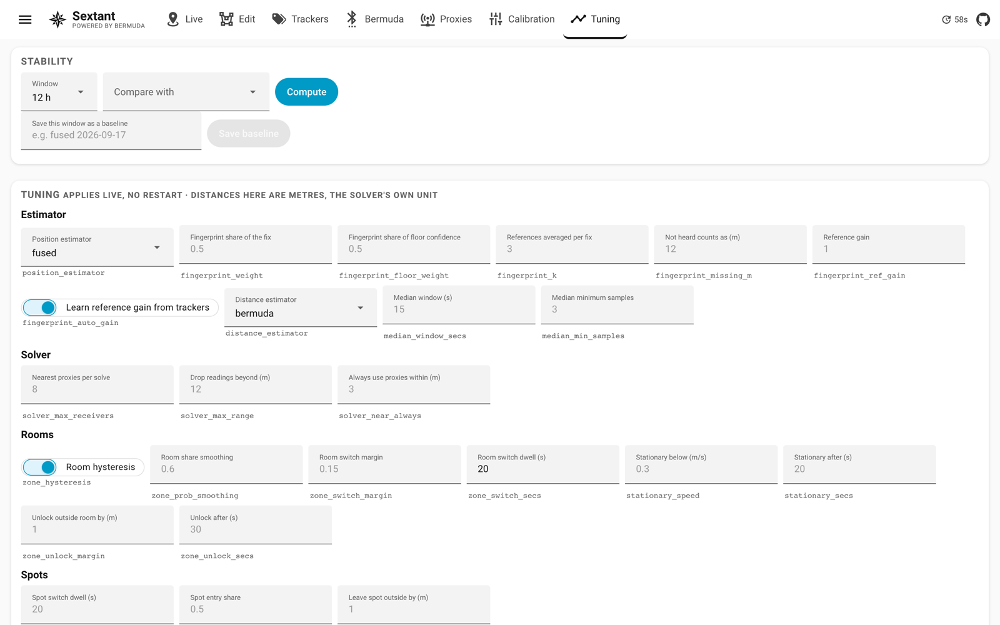

# Sextant

**Indoor positioning for Home Assistant, powered by [Bermuda](https://github.com/agittins/bermuda).**

Bermuda's Bluetooth proxies measure how far each phone, watch, pet tag or
Tile is from each proxy. Sextant turns those distances into a dot on your
floor plan, and from the dot into the four things automations want: which
**floor**, which **room**, which **spot** in the room, and the **nearest
room** when the fix sits between two. It keeps those answers steady while
the device is still, moves them promptly when it moves, and gives you one
panel to place proxies, draw rooms, calibrate, tune and manage Bermuda.

[](https://my.home-assistant.io/redirect/hacs_repository/?owner=davidcoulson&repository=sextant&category=Integration)



## TL;DR

- Bermuda gives you a distance from every Bluetooth proxy to every device.
  Sextant turns those into a position on your floor plan and four sensors
  per device: floor, room, spot and nearest room.
- Install from HACS, add the integration, draw your rooms and place your
  proxies in the panel, pick what to track. Nothing else to configure.
- Positions come from trilateration fused with fingerprints the proxies
  build by hearing each other; rooms need a margin and a dwell before
  they change, so sensors do not flap.
- If a tracker sits in the wrong place, tell it where it really is on the
  Live page and Sextant works out which settings fit that tracker best.

| Install | Configure | Tune | Automate |
|---|---|---|---|
| [Installation](#installation) · [What you need](#what-you-need) · [Upgrading from BPS](#upgrading-from-bps-or-bps-improved) | [The panel](#the-panel) · [Edit](#edit) · [Trackers](#trackers) · [Calibration](#calibration) | [Tuning reference](#tuning-reference) · [How positioning works](#how-positioning-works) · [Truth marks](#truth-marks) | [Sensors](#sensors) · [Map card](#map-card) · [Services](#services) · [API](#api) |

- [Where Sextant fits](#where-sextant-fits)
- [What you need](#what-you-need)
- [Installation](#installation)
- [The panel](#the-panel)
- [Sensors, card and API](#sensors-card-and-api)
- [How positioning works](#how-positioning-works)
- [Tuning reference](#tuning-reference)
- [Services](#services)
- [Tiles, Find My and Apple devices](#tiles-find-my-and-apple-devices)
- [Where the data lives](#where-the-data-lives)
- [Development](#development)
- [Credits](#credits)

## Where Sextant fits

Sextant is the fourth step in a lineage:

1. **[Bermuda](https://github.com/agittins/bermuda)** by [@agittins](https://github.com/agittins)
   reads Bluetooth advertisements through ESPHome and Shelly proxies and
   estimates a distance from every proxy to every device. It publishes a
   nearest *area* per device. It has no floor plan.
2. **[BPS](https://github.com/Hogster/BPS)** by [@Hogster](https://github.com/Hogster)
   put those distances on a floor plan: place the proxies, draw rectangular
   zones, trilaterate, and publish a zone and a floor sensor per device.
3. **[BPS-improved](https://github.com/maxi1134/BPS-improved)** by
   [@maxi1134](https://github.com/maxi1134) added polygon zones, sub-zones,
   proxy auto-calibration, Kalman smoothing, position history, floor
   election by hypothesis competition, no-go zones and a dark panel. BPS
   0.2.0 merged that work upstream.
4. **Sextant** grew out of BPS-improved and rebuilt the positioning and the
   panel. It is a new integration domain (`sextant`) with its own sensors
   and its own panel, developed against
   [a Bermuda fork](https://github.com/davidcoulson/bermuda) that exposes
   the APIs the extra features need.

### Capabilities at a glance

| | Bermuda | BPS | BPS-improved | Sextant |
|---|---|---|---|---|
| Distance per proxy, nearest area | yes | via Bermuda | via Bermuda | via Bermuda |
| Position on a floor plan | no | trilateration | trilateration, bounded to the floor | trilateration fused with proxy fingerprints |
| Rooms | HA areas | rectangles | polygons, adjuster | polygons, adjuster, undo, locks |
| Spots inside a room | no | no | point-in-polygon | elected by probability with dwell |
| Floor | no | nearest proxy | competition between floors | competition, k-nearest proximity, per-floor bias |
| Room stability | n/a | none | none | margin, dwell, stationary lock |
| Near-field anchor | no | no | no | yes |
| Smoothing | per distance | 3-sample average | Kalman | Kalman |
| Proxy calibration | manual rssi offset | no | probes calibrate each other | same, with 3D heights, written into Bermuda if you like |
| Proxy and tracker heights | no | no | proxy heights | proxy heights and per-tracker carry heights |
| No-go areas | no | no | yes | yes |
| Position history | no | session trail | scrubber, hours to days | scrubber, hours to days |
| Panel | config flow | iframe with a pasted token | dark iframe panel | native Home Assistant panel, seven pages |
| Manage Bermuda from the panel | n/a | no | no | track, untrack, Find My, Tiles, global options |
| Stability KPI and baselines | no | no | no | yes |
| Live tuning | options flow | no | no | every knob, no restart |
| Units | metres | metres | metres | Home Assistant's unit system |
| Map card | no | yes | with proxy status | same renderer as the panel |
| Updates to clients | polling | polling | polling | websocket push per cycle |
| SciPy | no | required | required | not needed |
| Tiles across address rotation | no | no | no | with the Bermuda fork |

## What you need

- **Home Assistant** 2026.x (developed on 2026.9).
- **Bermuda** tracking at least one device. For positioning alone upstream
  Bermuda is enough. For everything Sextant does, install
  [davidcoulson/bermuda](https://github.com/davidcoulson/bermuda) (the
  `fork-testing` releases): it adds the device-management API behind the
  Trackers and Bermuda pages, proxy-to-proxy ranging for fingerprint fusion
  and calibration, RSSI history for the median estimator, per-scanner RSSI
  offsets so calibration can be written into Bermuda, and Tile tracking
  across address rotations. Sextant detects what the installed Bermuda
  offers and hides what it cannot do.
- **Three or more Bluetooth proxies per floor** you want positions on:
  ESPHome `bluetooth_proxy` boards or Shelly Plus/Gen2+ devices. More is
  better; a proxy every three to four metres gives room-level accuracy.
- For calibration and fingerprint fusion, **each ESPHome proxy should
  advertise an iBeacon** so its siblings can range it (Shelly proxies
  already advertise). One block per proxy, same UUID across the fleet,
  unique `minor`:

  ```yaml
  esp32_ble_beacon:
    type: iBeacon
    uuid: fde3b150-2f64-43ba-aee9-867f75ee4a6f
    major: 1
    minor: ${ static_ip.split('.')[3] | int }
    min_interval: 500ms
    max_interval: 1000ms
  ```

No SciPy: the solver is pure numpy, so 32-bit and constrained installs work.

## Installation

1. HACS → Integrations → ⋮ → **Custom repositories**. Add
   `davidcoulson/sextant` as an Integration, then install **Sextant** and
   restart Home Assistant.
2. **Settings → Devices & Services → Add Integration → Sextant**. Bermuda
   must already be set up.
3. Open **Sextant** in the sidebar. On the **Edit** page add a floor from a
   floor-plan image, set its scale by measuring a known distance, place the
   proxies (picked from the list Bermuda reports), draw the rooms, Save.
4. On **Trackers**, pick what to track from everything Bermuda hears.
   Positions appear on **Live** within a cycle.

The integration's options (⋮ on its card) hold the sidebar toggle and the
positioning interval (15 s by default, 1 to 300).

### Upgrading from BPS or BPS-improved

Sextant is a separate integration, so this is a re-install rather than an
update:

1. Install Sextant and add the integration as above. On its first start it
   copies the old layout, calibration state, position history and map
   images from where BPS kept them. Nothing is deleted.
2. Remove the old BPS integration entry.
3. Update automations: `sensor.<device>_bps_zone` is now
   `sensor.<device>_sextant_room`, `_bps_floor` is `_sextant_floor`,
   `_bps_nearest_zone` is `_sextant_nearest_room`, and `_bps_sub_zone` is
   `_sextant_spot`. Services are `sextant.*`.
4. Dashboards switch to `custom:sextant-map-card` (resource
   `/sextant/sextant-map-card.js`). The old `custom:bps-map-card` type
   and the `/bps/` path were retired in 3.10.0.

## The panel

The panel is a native Home Assistant panel at `/sextant`: no iframe, no
copied token, Home Assistant's own form elements and theme, and one
websocket subscription for positions. Distances, heights and speeds are
shown in Home Assistant's unit system (inches under two feet, feet with one
decimal to five feet, whole feet beyond, or metres); the store and the
solver stay in metres. On a phone the pages reflow to one column with the
map above the list. The floor picker in the header lists floors the way
the house is stacked (top floor first, basement last) and follows the
tracker you focus.

### Live

The floor plan with every tracker drawn as an avatar in its own colour, the
same colour as its row in the list. Click a tracker (row or avatar) to
focus it: everything else fades, it grows a halo, the panel switches to its
floor, and the side panel shows its room, spot, floor, the proxy it is
anchored to if any, and every proxy that hears it with the distance; a
**Details** disclosure holds the floor odds, spot shares, confidence,
estimator telemetry, trust and speed. A **blend slider** from geometric to
fingerprint sets how this tracker's position is estimated (the two ends
are drawn on the map when the fingerprint switch is on), and **It's
actually here…** records a [truth mark](#truth-marks). A tracker with no fix shows *seen 40s
ago* rather than a blank. Switches draw the solver's distance circles, the
fingerprint fix, a trail, and hide the plan image. A history scrubber under
the map replays where a tracker has been over the retention window, with a
room band, playback and a jump-to-time picker.

### Edit


The same map as an editor. Place proxies from a searchable list of the
scanners Bermuda knows (a proxy belongs to one floor), drag them, give them
a mount height. Draw rooms, spots and no-go areas as polygons: vertices
drag, edge midpoints add a vertex, right-click removes one. Set the scale
by measuring a known distance. Give a floor a *level* (0 ground, -1
basement, 1 above) for ordering and an election *bias* (1.15 gives the
ground floor a standing head start). Padlocks lock rooms, spots and
proxies against selection so you cannot drag a wall while placing a proxy;
rooms start locked. Undo holds fifty steps. **Adjust rooms** squares
near-rectangles, snaps neighbours to shared walls and removes overlaps
with a live preview. Nothing is written until Save.

### Trackers



Bermuda's device management without its options flow. The top list is what
is tracked: click the name or the icon to open the tracker dialog and set a
display name, a class (person, dog, cat, phone, watch, keys, tag and more,
each with its icon on the map), the height it is carried at, a
reference-power trim, and its own position estimator. **Untrack** removes it from Bermuda.

Below is everything Bermuda hears but does not track, with the kind of
device (iBeacon, Tile, Apple, IRK, plain address), where it is (the room of
the loudest placed proxy) and the signal there in dBm, and for Apple
adverts what they are (AirPods and accessories, an iPhone, Watch or Mac
nearby, a Find My tag). Search by name, address, room, floor, proxy, kind
or maker. Adverts heard only by unplaced proxies are ignored, and the
proxies' own probe beacons are hidden. **Track…** opens the same dialog
first, so you choose the name, class and height before Bermuda is told and
reloads.

### Bermuda



Bermuda's global options (reference power, attenuation, max area radius,
max velocity, not-home timeout, update interval, smoothing samples, scanner
entities, Tile identity probes) edited in place; Bermuda reloads to apply.
**Add accessories…** walks through exporting a Find My accessory's keys and
pasting them. The Tiles card shows each configured Tile (click its name to rename it),
the address it is bound to, its rotation history, and an **Adopt** picker
for the moment Bermuda loses one; see
[Tiles](#tiles-find-my-and-apple-devices).

### Proxies



Every placed proxy grouped by floor and room, with a count per group of
online, quiet (no reading for two minutes), offline and unmatched (placed
but no scanner by that name or address). Each row shows the last time it
heard anything, its calibration correction and its height. A second card
lists what each proxy hears right now, so a proxy that is up but not
scanning stands out. The leave-one-out self-test solves every proxy from
its siblings' measurements and reports the error, published as
`sensor.sextant_position_accuracy` (CEP95, metres).

### Calibration



Proxies calibrate each other: every proxy hears every other proxy's beacon
at a known distance, a run collects those readings for the floor picked
in the header and solves one range correction per proxy. Start a timed run
or leave **Auto
calibration** on (samples every 30 s into a rolling six-hour window,
re-solves every 15 minutes, re-applies when a factor moves by more than
1 %). The result lists each proxy's factor and the equivalent dB, flags
low-confidence proxies, and compares the error before and after; a solve
that makes things worse is marked *do not apply* and Apply asks for a
confirmation before storing it. **Apply** stores the
factors with the layout, or with `calibration_target: bermuda` writes them
into Bermuda as per-scanner RSSI offsets so Bermuda's own sensors are
corrected too. **Reset** removes them.

### Tuning



The **stability KPI** reads the recorder for any window and reports, per
tracker, room changes per hour, the share that were A → B → A flips, and
the median dwell. Save a window as a named baseline and compare later
windows against it; the deltas turn green where the window is better. Every
[tuning key](#tuning-reference) is below it with a plain label, its meaning
on hover and the key underneath, grouped by estimator, solver, rooms,
spots, near-field anchor and floors, and applies on the next cycle without
a restart. Position history retention (off, one hour to seven
days) and **Clear history** live here too.

## Sensors, card and API

### Sensors

Each tracked device gets four sensors under its own `<device> (Sextant)`
device, nested beneath its Bermuda device:

| Sensor | State |
|---|---|
| `sensor.<device>_sextant_floor` | the elected floor |
| `sensor.<device>_sextant_room` | the elected room, with hysteresis and the stationary lock |
| `sensor.<device>_sextant_nearest_room` | the nearest room on that floor, instantaneous |
| `sensor.<device>_sextant_spot` | the spot inside the room, `unknown` when in none; attribute `room` |

`_sextant_nearest_room` drops to `unknown` as soon as no proxy reports a
distance (about 30 s, Bermuda's timeout): the clean "who is home" signal.
`_sextant_room` and `_sextant_floor` hold their value through a grace
period (`position_timeout`, five minutes by default) so a brief gap does
not blink someone out of a room; after it the tracker leaves the map and
all three read `unknown`. `sensor.sextant_position_accuracy` is the global
self-test result.

### Map card

```yaml
type: custom:sextant-map-card
floor: Ground Floor
entities:            # tracker keys as in /api/sextant/cords; omit for every tracker
  - davids_phone
title: Downstairs    # optional
height: 360          # px
circles: false       # the solver's distance circles
trails: true
labels: true
subzones: true       # draw spots
follow: false        # switch floors with the first entity
```

The card draws with the panel's renderer and the same subscription, so it
shows exactly what Live shows. `image` (a URL) or `map_file` (a file under
`/local/sextant_maps/`) overrides the floor's plan.

### API

- `GET /api/sextant/cords`: one row per tracker (`ent` is the tracker key)
  with its position (`cords`), confidence, the radii the solver used and
  their fit residual, `floor` and the floor probabilities (`floors`), the
  room (`zone`), the raw room, the lock state and speed, the spot and the
  spot shares (`sub_zones`), the anchor proxy, the estimator and the
  fingerprint telemetry (`fp`).
- `sextant/subscribe` over the websocket pushes the same payload plus proxy
  health once per positioning cycle:

  ```js
  hass.connection.subscribeMessage(
    (event) => console.log(event.positions, event.offline_receivers),
    { type: "sextant/subscribe" },
  );
  ```
- Websocket commands, all request/response: `layout/get`, `layout/save`,
  `receivers`, `scanner_linking`, `beacon_links`, `adjust_zones`,
  `calibration/status`, `calibration/action`, `history/index`,
  `history/get`, `history/clear`, `kpi`, `kpi/baselines`,
  `kpi/baseline/save`, `kpi/baseline/delete`, `tuning/set`,
  `tracker/tune`, `selftest`, `truth/mark`, `truth/list`,
  `truth/delete`, `truth/evaluate`, `truth/apply`, and under `bermuda/`: `candidates`,
  `tracked`, `track`, `scanners`, `scanner_ranging`, `options`,
  `options/set`, `findmy`, `findmy/add`, `findmy/remove`, `tiles`,
  `tile_identities`, `tile/bind`, `tile/adopt`. All are prefixed
  `sextant/`.
- `GET /api/sextant/selftest` runs the leave-one-out self-test on demand.

## How positioning works

Each cycle (15 s by default) runs this pipeline per tracker.

**Distances.** Bermuda's smoothed distance per proxy, or with
`distance_estimator: median` the median of the recent raw RSSI samples
converted with Bermuda's own path-loss parameters, which is symmetric where
Bermuda's running minimum reads far proxies short. Calibration factors and
the proxy and tracker heights are applied here: a slant range becomes a
horizontal one before it reaches the solver. Readings under 0.5 m are
weighted as "right here" rather than by 1/r².

**Which proxies.** Every proxy within `solver_near_always` metres plus the
nearest `solver_max_receivers`, dropping readings beyond `solver_max_range`
once three remain. Beyond eight metres a BLE range is mostly noise.

**The fit.** A bounded, robustly weighted least-squares trilateration in
pure numpy (`solver_numpy.py`, benchmarked against SciPy on a 48-proxy
layout), run in the executor. Spiky readings are down-weighted rather
than dropped. A fix that lands outside every room is snapped to the
nearest room; a fix in a no-go area is snapped out of it.

**Fingerprints.** Every proxy that advertises is heard by every other
proxy, so Bermuda continuously measures a labelled vector of ranges at a
known position: one reference fingerprint per proxy, for free. With
`position_estimator: fused` (the recommended setting once the reference
database has a minute of samples) a tracker's vector of ranges is matched
against those references and the fix is blended,
`(1 - fingerprint_weight) × fit + fingerprint_weight × fingerprint`. A
wall that makes a proxy read the tracker long makes it read the references
behind that wall long too, and the comparison cancels it. The gain
between probe beacons and trackers is learned from the trackers themselves
(`fingerprint_auto_gain`): a shared gain, plus a faster multiplier per
tracker, because a watch reads weak and a Tile reads hot. It is published
per fix as `fp.gain`. A match whose scale still disagrees with the tracker
counts for less (`fp.trust`, zero at a factor of three). A floor with only
one or two proxies can compete on its fingerprint. Any tracker can opt out
from its dialog on the Trackers page: **Positioning** is the estimator for
that tracker alone, so a tag the fingerprint makes worse can be geometric
only.

**Smoothing.** A constant-velocity Kalman filter on the position, in
metres so it behaves the same on any plan resolution; it resets on a floor
change or an absence.

**Floors.** Every floor with three or more proxies hearing the tracker is
solved and scored by how well its fit explains all of its proxies. A
through-ceiling reading fits one proxy and contradicts the rest. Scores
are scaled by proximity (the mean of the `floor_proximity_k` nearest
distances on this floor against the best competing floor) and by the
floor's `bias`, then smoothed; a challenger must lead for
`floor_switch_secs`, by a margin that grows with the incumbent's tenure.

**Rooms.** Membership, not a point test: samples on the filter's error
ellipse are attributed to rooms and the shares smoothed. The current room
holds until a challenger leads by `zone_switch_margin` for
`zone_switch_secs`. A tracker slower than `stationary_speed` for
`stationary_secs` is on a table and its room locks; it unlocks after
`zone_unlock_secs` more than `zone_unlock_margin` outside, or when it
clearly moves.

**Spots.** The same election scaled down: the share of the ellipse inside
each spot of the elected room, entered at `subzone_enter_prob`, left at
`subzone_unlock_margin` outside, every change waiting
`subzone_switch_secs`. A locked room keeps its spot.

**Near-field anchor.** A tracker one proxy reads inside `anchor_max_m`
with every other proxy at least `anchor_ratio` times farther, for
`anchor_secs`, is placed on that proxy: a watch on the bedside table next
to its proxy, not 1.7 m away where the far proxies' errors pull the fit.
Released once the reading opens past `anchor_release_m`.

**Calibration.** Probe-to-probe ranges against the placed positions (3D
when both proxies have heights) solve a per-proxy multiplier, normalised so
they never rescale everything at once. A multiplier is exactly a
per-scanner RSSI offset in Bermuda's model, which is how
`calibration_target: bermuda` writes it.

## Truth marks

When a tracker sits in the wrong place, select it on the Live page, click
**It's actually here…** and click the spot on the map where it really is.
Sextant keeps the solver inputs of the last few minutes for every
tracker, so it re-solves those cycles under every blend of geometric fit
and fingerprint match and every reference gain, and shows how far each
lands from your mark and how often it gets the room right. **Apply** on a
row makes those the tracker's settings (its blend weight, and a gain
multiplier folded into its learned gain). One mark can overfit, so mark a
tracker in two or three rooms.

Marks stay, with their samples, in `.storage/sextant_truth`, and do two
more jobs. The Tuning page's **Accuracy** card re-solves every mark under
the settings in force and reports, per tracker, the mean error in metres
and the share of cycles in the right room: the accuracy figure the
stability KPI cannot give. And each mark becomes a fingerprint reference
at the marked point, in the marking tracker's own scale, so rooms with no
probe nearby get a reference too (`fingerprint_marks` turns that off).

## Tuning reference

Set from the Tuning page or `sextant.set_tuning`. Stored with the layout;
distances in metres.

| Key | Default | Effect |
|---|---|---|
| `position_estimator` | `geometric` | `geometric`, `fingerprint` or `fused` |
| `fingerprint_weight` | 0.5 | fingerprint share of a fused fix |
| `fingerprint_floor_weight` | 0.5 | fingerprint share of a floor's confidence |
| `fingerprint_k` | 3 | references averaged per fix |
| `fingerprint_missing_m` | 12 | how far "not heard" counts as |
| `fingerprint_ref_gain` | 1.0 | probe beacons hotter (<1) or cooler (>1) than trackers |
| `fingerprint_auto_gain` | true | learn the rest of that gain from the trackers |
| `fingerprint_marks` | true | truth marks double as fingerprint references |
| `distance_estimator` | `bermuda` | `bermuda` or `median` |
| `median_window_secs` | 15 | samples newer than this feed the median |
| `median_min_samples` | 3 | fewer falls back to Bermuda's distance |
| `solver_max_receivers` | 8 | nearest proxies per solve (0 = all) |
| `solver_max_range` | 12 | drop readings beyond this once three remain (0 = never) |
| `solver_near_always` | 3 | proxies within this always count |
| `zone_hysteresis` | true | off publishes the instantaneous room |
| `zone_prob_smoothing` | 0.6 | weight on the previous room shares |
| `zone_switch_margin` | 0.15 | lead a challenger room needs |
| `zone_switch_secs` | 20 | held that long before switching |
| `stationary_speed` | 0.3 | m/s; slower is "still" |
| `stationary_secs` | 20 | still this long locks the room |
| `zone_unlock_margin` | 1.0 | metres outside the locked room |
| `zone_unlock_secs` | 30 | for this long to unlock |
| `subzone_switch_secs` | 20 | dwell before a spot change |
| `subzone_enter_prob` | 0.5 | smoothed share needed to enter a spot |
| `subzone_unlock_margin` | 1.0 | metres outside a spot before leaving it |
| `floor_switch_secs` | 60 | a challenger floor must lead this long |
| `floor_tenure_bonus` | 0.05 | extra margin at full tenure |
| `floor_tenure_full_secs` | 600 | tenure counted up to this |
| `floor_proximity_weight` | 0.5 | how much proximity scales a floor's score (0 = fit only) |
| `floor_proximity_k` | 3 | nearest proxies averaged for proximity |
| `anchor_max_m` | 0.8 | anchor when one proxy reads closer than this (0 = off) |
| `anchor_ratio` | 2 | every other proxy at least this many times farther |
| `anchor_secs` | 20 | for this long |
| `anchor_release_m` | 1.5 | release once the reading opens past this |
| `calibration_target` | `sextant` | where Apply writes: `sextant` or `bermuda` |

Two more live at the top level of the layout: `position_timeout` (seconds
before an unheard tracker leaves the map, 300) and `tracker_height` (the
default carry height in metres, 1.0; per-tracker heights come from the
Trackers page).

## Services

| Service | Fields | Does |
|---|---|---|
| `sextant.start_calibration` | `floor`, `duration` (600) | sample one floor and solve |
| `sextant.cancel_calibration` | | stop a run or turn auto calibration off |
| `sextant.apply_corrections` | `floor` | apply the last solve |
| `sextant.reset_corrections` | `floor` | remove a floor's corrections |
| `sextant.set_auto_calibration` | `enabled` | continuous calibration on or off |
| `sextant.set_receiver_heights` | `heights` (slug → m), `default` | proxy mount heights |
| `sextant.set_tracker_heights` | `heights` (tracker → m) | carry heights |
| `sextant.set_tuning` | `settings`, `reset` | any [tuning key](#tuning-reference); an unknown key or out-of-range value is refused with the allowed range |

```yaml
action: sextant.set_tuning
data:
  settings: {position_estimator: fused, zone_switch_secs: 30}
```

## Tiles, Find My and Apple devices

**Tiles** rotate their Bluetooth address, and rotate again right after any
connection, so an address never names one for long. The Bermuda fork
tracks a Tile as a metadevice (`tile_<id>`) and follows rotations by
matching the per-proxy RSSI pattern of the old and new address, which
needs at least two proxies hearing both. The pattern is remembered, so a
Tile is found again after a restart. When one is lost anyway (marked *not
heard*, typically a Tile sitting among other Tiles), the Bermuda page's
**Adopt** picker lists the live Tile addresses with the room of the
loudest proxy; pick the one where the Tile is. *Tile identity probes*
reads each Tile's ID over Bluetooth, but on the Private ID Tiles seen so
far that ID rotates with the address, so the switch stays off unless your
Tiles keep a stable ID. Ringing a Tile needs the Tile account's
authentication and is not possible from here. Name a Tile from the
Trackers page ("Kitchen keys") so the map does not show an address.

**Find My accessories** (AirTags and licensed tags) rotate on a key
schedule. Export the accessory's pairing keys (`master_key`, `skn`, `sks`,
`paired_at`, as the FindMy.py library's `FindMyAccessory.to_json()`
produces) and paste them in the walkthrough on the Bermuda page; Bermuda
then derives the addresses the tag can be using and tracks it like an IRK
device. The keys live in Bermuda's config entry; treat backups and
diagnostics accordingly.

**Apple phones and watches** come in through Home Assistant's Private BLE
Device integration (their IRK) and appear in Bermuda automatically. The
heard list labels other Apple adverts by type so you can tell AirPods from
an iPhone from a Find My tag before tracking anything.

## Where the data lives

| What | Where |
|---|---|
| Layout: floors, rooms, spots, proxies, heights, corrections, tuning, tracker names and classes | `config/.storage/sextant` |
| Calibration solves and the rolling sample window | `config/.storage/sextant_calibration_state` |
| Stability baselines | `config/.storage/sextant_kpi_baselines` |
| Truth marks with their samples | `config/.storage/sextant_truth` |
| Learned fingerprint gains, saved every five minutes so a restart starts warm | `config/.storage/sextant_fingerprint_gains` |
| Position history, one NDJSON segment per day, pruned to the retention | `config/.storage/sextant_history/` |
| Floor-plan images | `config/www/sextant_maps/` |

Nothing under `.storage` is served over HTTP. Edit the layout from the
panel or the services, not the file: a hand edit under a running Home
Assistant is lost on the next save.

## Development

```bash
pip install -r requirements_test.txt
pytest tests
```

- `tools/flap_kpi.py` computes the stability KPI from the recorder from a
  shell (`--hours 12 --json before.json`, later `--baseline before.json`).
- `tools/sextant_eval.py` replays a layout against recorded readings;
  `tools/solver_bench.py` benchmarks the numpy solver against SciPy.
- `tools/brand/` builds the logo from the same compass rose the sidebar uses.
- The panel is plain Lit modules under `custom_components/sextant/frontend/`
  with no build step. The backend registers the panel module with the
  manifest version in its URL, so a page loaded before an update offers a
  reload on its own.

Issues and pull requests are welcome on
[davidcoulson/sextant](https://github.com/davidcoulson/sextant).

## Credits

Sextant began as a fork of [Hogster/BPS](https://github.com/Hogster/BPS)
via [maxi1134/BPS-improved](https://github.com/maxi1134/BPS-improved).
Full credit for the original integration goes to
[@Hogster](https://github.com/Hogster) and [@maxi1134](https://github.com/maxi1134),
to [@agittins](https://github.com/agittins) for
[Bermuda](https://github.com/agittins/bermuda), and to
[Megarushing](https://github.com/Megarushing/bermuda) for the Find My
accessory support merged into the Bermuda fork. MIT licensed, see
[LICENSE](LICENSE).
