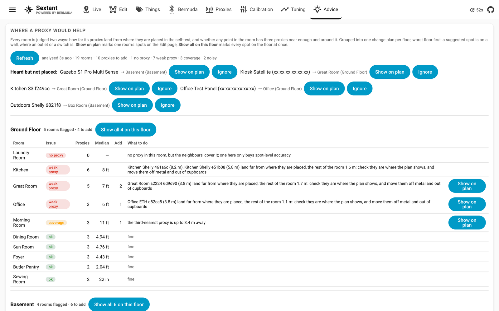

[Sextant](../README.md) › Advice

# Advice

Which rooms the proxies serve worst, and where one more would help. Press
**Analyse the house** and every room on every floor is judged two ways:

- **measured**: in the self-test, how far the proxies placed in the room land
  from where they are placed (median, and the worst one);
- **geometric**: for a grid of points inside the room, how far away the
  third-nearest proxy on the floor is (a fix needs three) and whether the
  three nearest all sit to one side of the point.

The rooms are grouped into one change plan per floor, worst floor first (a
floor ranks by its single worst room, ties broken by how many proxies it
needs), with each floor's own rooms worst first inside it. Each floor
heading carries its own tally — how many rooms are flagged and how many
proxies to add — so a floor is one trip up the stairs with one list.

Each room gets an issue:

| Issue | Meaning | What it suggests |
|---|---|---|
| no proxy | nothing placed in the room | a wall spot, unless the neighbours' proxies already reach all of it |
| weak proxy | one proxy lands far off while the rest of the room is fine | check that proxy is where the plan shows; move it off metal and out of cupboards |
| coverage | part of the room has its third proxy more than 5 m away | one or two wall spots, chosen one at a time to cover what is still uncovered |
| one-sided | the three nearest proxies sit to one side for most of the room | the same |
| noisy | covered, but every proxy in the room lands 2 m or more off | check the floor's scale and each proxy's position, set mount heights; one far-wall spot for a fourth opinion |
| ok | under 2 m and covered | nothing |

Suggested spots sit just inside a wall, where an outlet or a switch would
be. **Show on plan** opens the Edit page on that floor with one room's
spots marked, and **Show all N on this floor** marks every spot the floor
needs at once, each ring labelled with its room — the whole floor's work in
one view before you pick up a drill. The plan fades back behind the rings
while they are shown, and they are numbered, so four suggestions are not
something to hunt for among sixty proxies. Placing a proxy there is the usual
Place tool. Proxies Bermuda hears that sit on no floor are listed at the
top, each with the spot that needs it most.

Like the self-test, the analysis works from the calibration sample window,
so keep **Auto calibration** on for it to see every floor.

## Scanners you leave off the plan on purpose

A kiosk, a test board or an outdoor proxy shows up under "Heard but not
placed" on this page and on Proxies for as long as Bermuda hears it. Click
**Ignore** next to it and both lists leave it out; the ignored ones are
listed under the row with an **Un-ignore** button. The list is kept in the
layout, so it survives edits and restarts.
