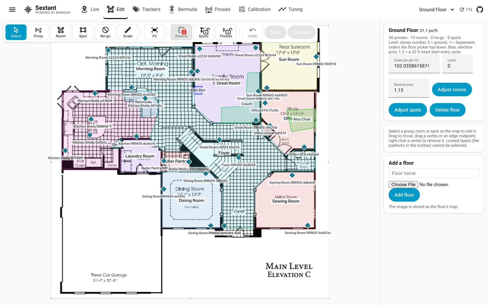

[Sextant](../README.md) › Edit

# Edit



The same map as an editor. Place proxies from a searchable list of the
scanners Bermuda knows (a proxy belongs to one floor), drag them, give them
a mount height. A dragged proxy snaps onto a wall within about 25 cm, a few
centimetres inside the room you are dragging it from, and stays on that
side until you pull it well past the wall: a proxy in an outlet or a switch
is part of the wall, and which side it lands on decides which room it
counts for. Hold Alt to place one freely. Draw rooms, spots and no-go areas as polygons: vertices
drag, edge midpoints add a vertex, right-click removes one. Set the scale
by measuring a known distance. Give a floor a *level* (0 ground, -1
basement, 1 above) for ordering and an election *bias* (1.15 gives the
ground floor a standing head start). Padlocks lock rooms, spots and
proxies against selection so you cannot drag a wall while placing a proxy;
rooms start locked. Undo holds fifty steps. **Adjust rooms** squares
near-rectangles, snaps neighbours to shared walls and removes overlaps
with a live preview. Nothing is written until Save.

## A busier plan than the map needs

A plan drawn for a builder carries a tile hatch over every floor, room
names, room dimensions and a title block. Sextant draws its own rooms,
proxies and trackers on top of it, and all that ink competes with them —
badly, on a phone. `tools/clean_floorplan.py` strips a plan down to its
walls and door swings, which is all the map needs behind the rooms you
draw:

```bash
python3 tools/clean_floorplan.py "Ground Floor.jpg" -o "Ground Floor.png"
```

It keeps the image's pixel dimensions, so the floor's scale and everything
already placed on it still line up; upload the result as that floor's plan.
What separates a wall from the rest is weight, so `--thick` is the knob
that matters: raise it if hatch survives, lower it if walls break up. Keep
the original — every plan is drawn differently, and this is a one-way
trip.
