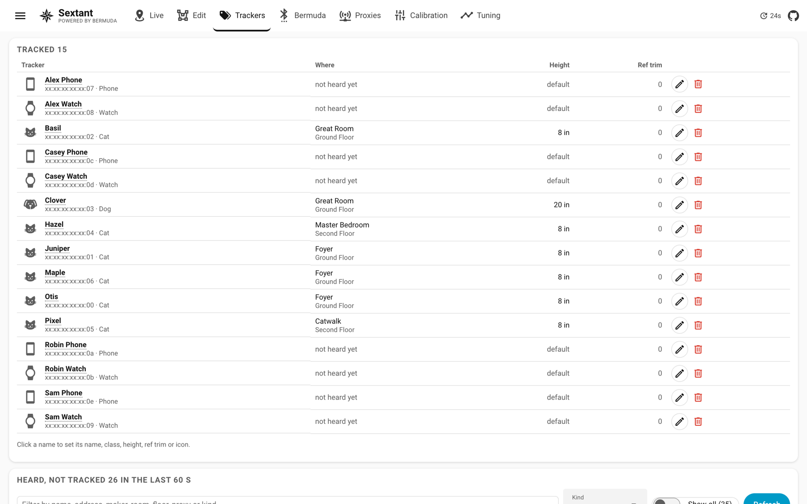

[Sextant](../README.md) › Things

# Things

Bermuda's device management without its options flow. The top list is what
is tracked: click the name or the icon to open the thing dialog and set a
display name, a class (person, dog, cat, phone, watch, keys, tag and more,
each with its icon on the map), a colour used everywhere it is drawn, a
photo framed in a circle that replaces the icon, the height it is carried
at, a reference-power trim, and its own position estimator. **Untrack** removes it from Bermuda and
removes its four Sextant sensors and its device with it; a device untracked
while Home Assistant was down is cleaned up on the next cycle.

Below is everything Bermuda hears but does not track, with the kind of
device (iBeacon, Tile, Apple, IRK, plain address), where it is (the room of
the loudest placed proxy) and the signal there in dBm, and for Apple
adverts what they are (AirPods and accessories, an iPhone, Watch or Mac
nearby, a Find My tag). Search by name, address, room, floor, proxy, kind
or maker. Adverts heard only by unplaced proxies are ignored, and the
proxies' own probe beacons are hidden. **Track…** opens the same dialog
first, so you choose the name, class and height before Bermuda is told and
reloads.
